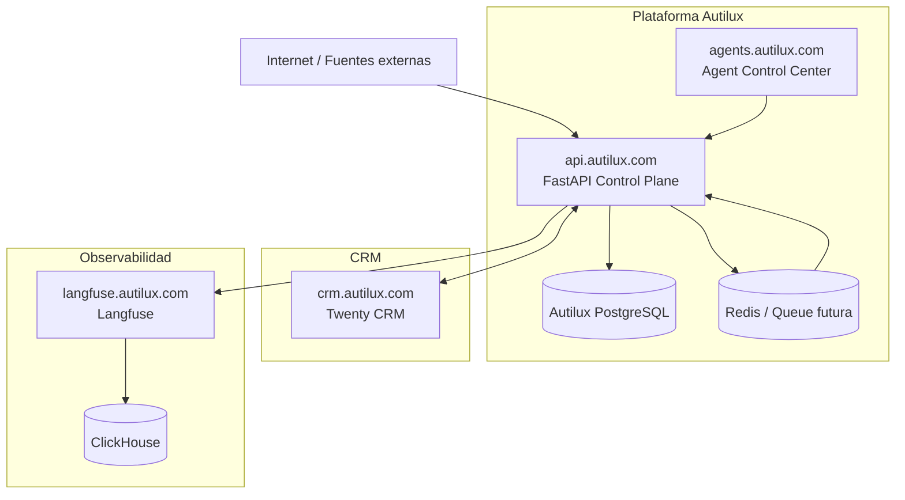
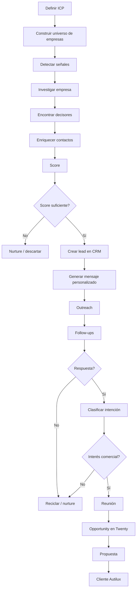
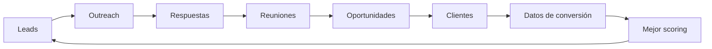

# Autilux.com — Proyecto, Infraestructura, Arquitectura y Motor de Generación de Demanda

**Fecha de estado:** 10 de agosto de 2026  
**Proyecto:** Autilux.com  
**Vertical:** Movilidad eléctrica para empresas  
**Objetivo:** construir un sistema autónomo capaz de identificar empresas con alta probabilidad de compra, investigarlas, encontrar decisores, personalizar el contacto, ejecutar outreach, calificar respuestas y transformar señales comerciales en oportunidades dentro de Twenty CRM.

---

# 1. Visión de Autilux

Autilux busca ayudar a empresas a incorporar movilidad eléctrica mediante proyectos que pueden incluir:

- electrificación de flotas;
- vehículos eléctricos para uso corporativo;
- infraestructura de carga;
- carga en oficinas, depósitos, plantas, centros logísticos y estacionamientos;
- reducción de costos operativos;
- reducción de emisiones;
- planificación de transición desde vehículos a combustión;
- análisis técnico y económico de proyectos de electromovilidad.

La ventaja que estamos construyendo no es solamente comercial. Autilux contará con un **motor propio de generación de demanda basado en agentes**, diseñado para detectar oportunidades antes de que se conviertan en búsquedas explícitas de proveedores.

---

# 2. Objetivo comercial

No buscamos una gran cantidad de contactos. Buscamos:

> **empresa correcta + necesidad detectable + momento adecuado + decisor correcto + mensaje relevante**

Las métricas principales serán:

- leads calificados;
- reuniones calificadas;
- oportunidades creadas;
- pipeline generado;
- valor del pipeline;
- tasa lead → reunión;
- tasa reunión → oportunidad;
- tasa oportunidad → cliente;
- costo por reunión;
- costo por oportunidad;
- CAC;
- ingresos atribuibles al sistema.

---

# 3. Flow general del motor comercial


Cada agente ejecuta una parte específica del proceso y deja trazabilidad de su trabajo.

---

# 4. Arquitectura general



---

# 5. Responsabilidad de cada sistema

## Twenty CRM

Twenty es el **sistema comercial de registro**. Debe almacenar y administrar:

- Companies;
- People;
- Opportunities;
- actividades comerciales;
- pipeline;
- estados de oportunidad;
- historial comercial;
- tareas de ventas.

Autilux no debe duplicar estas entidades en su propia base. Los agentes interactúan con Twenty mediante su API.

## Autilux FastAPI

`api.autilux.com`

Es el **control plane** de la plataforma. Responsabilidades:

- autenticación;
- usuarios internos;
- agentes;
- agent runs;
- eventos operativos;
- integraciones;
- conexión con Twenty;
- conexión con Langfuse;
- ejecución de workflows;
- scoring;
- reglas de negocio;
- futuras integraciones con email, WhatsApp y otras fuentes.

## Langfuse

`langfuse.autilux.com`

Es la capa de **observabilidad de agentes y LLMs**. Permite observar:

- traces;
- observations/spans;
- inputs;
- outputs;
- metadata;
- errores;
- latencia;
- comportamiento de agentes;
- llamadas a modelos;
- costos de IA.

Ejemplo conceptual:

```text
Agent Run #381
│
├── Discovery
│   ├── buscar empresas
│   └── filtrar ICP
│
├── Research
│   ├── analizar website
│   ├── noticias
│   └── señales de compra
│
├── Enrichment
│   ├── decisor
│   ├── email
│   └── teléfono
│
├── Copywriting
│   └── mensaje personalizado
│
└── Outreach
    ├── email
    ├── follow-up
    └── respuesta
```

---

# 6. Infraestructura actual

## VPS

Proveedor: **Contabo**

- Ubuntu 24.04 LTS;
- 8 vCPU AMD EPYC;
- 24 GB RAM;
- ~450 GB almacenamiento;
- 8 GB swap;
- Docker;
- Docker Compose;
- UFW;
- Fail2ban;
- tmux.

Servidor público:

```text
169.58.133.212
```

## DNS / servicios

| Dominio | Servicio |
|---|---|
| `autilux.com` | sitio principal |
| `crm.autilux.com` | Twenty CRM |
| `api.autilux.com` | FastAPI |
| `agents.autilux.com` | futuro Agent Control Center |
| `langfuse.autilux.com` | Langfuse |

## Reverse proxy

Se utiliza **Traefik v3** para:

- routing;
- HTTPS;
- certificados Let's Encrypt;
- exposición segura de servicios;
- conexión sobre red Docker compartida.

Red compartida:

```text
autilux
```

Los servicios internos no necesitan publicar puertos directamente al host.

---

# 7. Estructura del proyecto

Directorio principal:

```text
/opt/autilux
```

Estructura conceptual:

```text
/opt/autilux
├── README.md
├── backups/
├── compose/
│   ├── api/
│   │   └── compose.yml
│   ├── postgres/
│   │   └── compose.yml
│   ├── traefik/
│   │   └── compose.yml
│   ├── twenty/
│   │   ├── compose.yml
│   │   └── .env
│   └── langfuse/
│       ├── compose.yml
│       ├── compose.override.yml
│       ├── .env
│       └── source/        # repo oficial ignorado por Git
│
├── services/
│   └── api/
│       ├── Dockerfile
│       ├── requirements.txt
│       ├── .env
│       └── app/
│           ├── db/
│           ├── integrations/
│           ├── models/
│           ├── routers/
│           ├── schemas/
│           └── ...
│
├── data/
├── logs/
└── secrets/
```

---

# 8. Base de datos Autilux

PostgreSQL separado del PostgreSQL de Twenty.

Tablas actuales:

```text
users
agents
agent_runs
agent_events
```

## `agents`

Define qué agentes existen. Ejemplos futuros:

```text
directory-discovery
google-maps-discovery
company-research
decision-maker-research
contact-enrichment
lead-scoring
copywriter
email-outreach
follow-up
response-classifier
crm-sync
```

Estados posibles:

```text
idle
running
paused
error
disabled
```

## `agent_runs`

Representa una ejecución operacional.

```text
Run #742
Agent: company-research
Company: ACME Logistics
Status: completed
Started: 15:32
Finished: 15:34
```

## `agent_events`

Debe guardar eventos de negocio u operación útiles para Autilux, sin duplicar la telemetría técnica que ya administra Langfuse.

Ejemplos:

```text
lead_discovered
lead_qualified
decision_maker_found
contact_verified
outreach_started
reply_received
meeting_booked
opportunity_created
```

---

# 9. Sistema completo de generación de demanda



---

# 10. Paso 1 — Definir el ICP

Antes de buscar leads necesitamos definir qué empresa tiene mayor probabilidad de comprar.

Primera hipótesis de ICP para Autilux:

## Flotas

Empresas con:

- vehículos comerciales;
- autos corporativos;
- utilitarios;
- camionetas;
- flotas de servicio técnico;
- flotas de última milla;
- vehículos para vendedores;
- transporte interno.

## Infraestructura

Empresas con:

- oficinas corporativas;
- estacionamientos;
- plantas;
- depósitos;
- centros logísticos;
- hoteles;
- centros comerciales;
- concesionarios;
- parques industriales.

## Tamaño inicial sugerido

Priorizar:

```text
20+ empleados
10+ vehículos
múltiples ubicaciones
operación intensiva en movilidad
```

No es necesario que una empresa cumpla todas las condiciones.

---

# 11. Verticales iniciales de alto potencial

## Logística y distribución

Señales relevantes:

- flota propia;
- última milla;
- depósitos;
- centros de distribución;
- expansión operativa.

## Empresas de servicios técnicos

Ejemplos:

- telecomunicaciones;
- alarmas;
- mantenimiento;
- climatización;
- energía;
- facilities;
- servicios industriales.

Suelen operar muchas camionetas o utilitarios.

## Empresas con fuerza comercial móvil

Ejemplos:

- consumo masivo;
- farmacéuticas;
- seguros;
- servicios B2B;
- distribuidores.

## Hoteles

Potencial:

- cargadores para huéspedes;
- flota corporativa;
- diferenciación ESG.

## Real estate corporativo

- oficinas;
- edificios AAA;
- estacionamientos;
- parques empresariales.

Potencial: infraestructura de carga para empleados y visitantes.

## Centros comerciales

Potencial:

- charging destination;
- mayor permanencia;
- servicio premium;
- posicionamiento sustentable.

## Industria

Potencial:

- flotas internas;
- utilitarios;
- estacionamiento de empleados;
- metas de sustentabilidad.

---

# 12. Paso 2 — Discovery

Los Discovery Agents construyen un universo de cuentas potenciales.

Fuentes posibles:

- Google Maps;
- directorios empresariales;
- cámaras empresariales;
- parques industriales;
- asociaciones sectoriales;
- sitios corporativos;
- LinkedIn público;
- buscadores;
- bases abiertas;
- portales de empleo;
- noticias;
- ferias y eventos;
- directorios logísticos;
- páginas de partners/proveedores.

Output inicial esperado:

```json
{
  "company_name": "Empresa X",
  "website": "https://...",
  "industry": "Logística",
  "location": "Buenos Aires",
  "source": "Google Maps"
}
```

---

# 13. Paso 3 — Qualification inicial

No toda empresa descubierta debe pasar a investigación profunda.

Filtros rápidos:

- tamaño;
- sector;
- localización;
- cantidad estimada de vehículos;
- número de sedes;
- tipo de operación;
- disponibilidad de estacionamiento;
- relevancia para movilidad eléctrica.

Resultado:

```text
REJECT
LOW
MEDIUM
HIGH
```

Inicialmente solo `MEDIUM` y `HIGH` avanzan.

---

# 14. Paso 4 — Research de empresa

El Research Agent debe entender la empresa antes de contactar a nadie.

Debe investigar:

- qué hace;
- cantidad aproximada de empleados;
- ubicaciones;
- operaciones;
- tipo de flota;
- expansión;
- clientes;
- proyectos;
- políticas de sustentabilidad;
- objetivos ESG;
- electrificación existente;
- infraestructura;
- crecimiento;
- noticias recientes;
- búsquedas laborales;
- adquisiciones;
- licitaciones;
- contratos importantes.

---

# 15. Señales de compra

Las señales permiten contactar a una empresa en el momento correcto.

## Señales de flota

```text
"renovación de flota"
"nuevos vehículos"
"ampliación de flota"
"última milla"
"nueva operación logística"
"nuevas rutas"
```

## Señales de infraestructura

```text
"nueva planta"
"nuevo depósito"
"nuevo centro logístico"
"nuevas oficinas"
"ampliación de estacionamiento"
```

## Señales ESG

```text
"net zero"
"carbon neutral"
"reducción de emisiones"
"ESG"
"sustentabilidad"
"electromovilidad"
```

## Señales organizacionales

```text
nuevo gerente de flota
nuevo gerente de operaciones
nuevo sustainability manager
nuevo procurement manager
```

## Señales de contratación

Ofertas laborales para cargos como:

```text
Fleet Manager
Logistics Manager
Operations Manager
Sustainability Manager
Facilities Manager
Procurement Manager
```

pueden indicar inversión o crecimiento.

---

# 16. Paso 5 — Decision Maker Research

No alcanza con identificar la empresa. Hay que encontrar a la persona responsable de la decisión.

## Para proyectos de flota

- Fleet Manager;
- Gerente de Operaciones;
- Logistics Manager;
- Gerente General;
- Procurement;
- CFO.

## Para infraestructura de carga

- Facilities Manager;
- Real Estate Manager;
- Operations Manager;
- Sustainability Manager;
- Procurement.

## Para proyectos ESG

- Sustainability Director;
- ESG Manager;
- CSR Manager;
- CEO.

---

# 17. Paso 6 — Contact Enrichment

Objetivo: obtener canales de contacto verificables.

Datos:

```text
nombre
apellido
cargo
empresa
LinkedIn
email corporativo
teléfono
WhatsApp si corresponde
```

Cada dato debe conservar además:

```text
source
confidence
verified_at
verification_status
```

No queremos llenar Twenty de emails dudosos.

---

# 18. Paso 7 — Lead Scoring

Cada cuenta recibe un score.

Ejemplo inicial:

| Variable | Peso |
|---|---:|
| Fleet fit | 20 |
| Company size | 10 |
| Sector fit | 10 |
| Infrastructure fit | 10 |
| Sustainability signal | 15 |
| Recent trigger | 15 |
| Decision maker found | 10 |
| Verified contact | 10 |

Total:

```text
100 puntos
```

Clasificación:

```text
80–100 = HOT
60–79  = HIGH
40–59  = MEDIUM
0–39   = LOW
```

Threshold inicial para comenzar outreach:

```text
score >= 60
```

Este scoring debe evolucionar utilizando datos reales de conversión.

---

# 19. Paso 8 — Crear cuenta en Twenty

Cuando un prospect supera el threshold:

## Company

Crear o actualizar:

```text
Company
Industry
Website
Location
Company Size
Lead Score
Signals
Research Summary
```

## Person

Crear:

```text
First Name
Last Name
Job Title
Email
LinkedIn
Phone
```

## Opportunity

No necesariamente crear inmediatamente. Lo ideal es crearla cuando exista una señal comercial fuerte:

```text
respuesta positiva
reunión
pedido de información
proyecto identificado
```

---

# 20. Paso 9 — Hyperpersonalization

El Copywriting Agent no debe generar spam genérico.

Debe combinar:

```text
ICP
+
empresa
+
persona
+
cargo
+
trigger
+
problema probable
+
propuesta Autilux
```

Ejemplo conceptual:

```text
Empresa:
operador logístico con 80 utilitarios

Trigger:
acaba de abrir un nuevo centro de distribución

Persona:
Gerente de Operaciones

Hipótesis:
renovación o expansión de flota

Propuesta:
electrificación gradual de utilitarios + carga en depósito + comparación TCO
```

---

# 21. Principio de mensajes

Un mensaje comercial debe responder rápidamente:

1. ¿Por qué me escribís a mí?
2. ¿Por qué ahora?
3. ¿Qué problema entendiste?
4. ¿Qué resultado podrías generar?
5. ¿Cuál es el próximo paso simple?

Ejemplo estructural:

```text
Asunto:
Electrificación de flota en [Empresa]

Hola [Nombre],

vi que [señal específica de la empresa].

En operaciones como la de [Empresa], ese tipo de crecimiento suele abrir
una buena oportunidad para analizar qué parte de la flota ya puede pasar
a eléctrico sin aumentar complejidad operativa.

En Autilux trabajamos sobre el proyecto completo:
vehículos + infraestructura de carga + análisis operativo/económico.

Si tiene sentido, podemos hacer un primer diagnóstico de viabilidad sobre
la operación actual.

¿Te sirve verlo durante 20 minutos esta semana?
```

El agente debe personalizar el mensaje según cada caso.

---

# 22. Paso 10 — Outreach multicanal

Primera etapa:

```text
Email
```

Posteriormente:

```text
Email + LinkedIn + WhatsApp + llamada
```

La coordinación debe ser centralizada para evitar mensajes duplicados.

Secuencia inicial sugerida:

```text
Día 0   Email 1 — trigger + hipótesis
Día 3   Follow-up 1 — insight adicional
Día 7   Follow-up 2 — caso / TCO
Día 12  Follow-up 3 — pregunta corta
Día 20  Break-up / nurture
```

No todas las cuentas deben recibir exactamente la misma secuencia.

---

# 23. Paso 11 — Response Classification

Cada respuesta debe clasificarse automáticamente.

Categorías:

```text
POSITIVE
INTERESTED_LATER
QUESTION
REFERRAL
NOT_INTERESTED
OUT_OF_OFFICE
WRONG_PERSON
UNSUBSCRIBE
```

Ejemplo:

```text
"Habla con Juan de operaciones"
```

Resultado:

```text
REFERRAL
```

Entonces el sistema investiga a Juan y continúa.

---

# 24. Paso 12 — Lead calificado / SQL

Un lead se considera realmente calificado cuando existe suficiente combinación de:

- fit;
- necesidad;
- timing;
- autoridad;
- interés.

Ejemplo:

```text
Empresa con 40 vehículos
+
renovación de flota durante próximos 12 meses
+
responsable de operaciones identificado
+
interés en evaluar eléctricos
```

Eso ya debería transformarse en una oportunidad comercial.

---

# 25. Paso 13 — Reunión

El objetivo del outbound no es vender un vehículo en el email. Es conseguir una conversación comercial relevante.

La reunión debería capturar:

```text
cantidad de vehículos
tipología
kilómetros/día
rutas
lugares de estacionamiento
horarios
energía disponible
planes de renovación
presupuesto
objetivos ESG
timeline
decisores
```

---

# 26. Paso 14 — Opportunity

Después de una reunión calificada, Twenty debe registrar una Opportunity.

Pipeline conceptual:

```text
Qualified
↓
Discovery
↓
Technical Assessment
↓
Proposal
↓
Negotiation
↓
Won / Lost
```

---

# 27. Paso 15 — Conversión a cliente

La venta puede requerir análisis técnico y financiero.

Autilux puede generar:

- análisis de flota;
- recomendación de vehículos;
- sizing de infraestructura;
- estrategia de carga;
- estimación de CAPEX;
- estimación de OPEX;
- TCO;
- ahorro estimado;
- reducción de emisiones;
- plan de implementación.

---

# 28. Flywheel de datos



Después de suficiente volumen podremos descubrir:

- industrias que convierten mejor;
- señales que predicen compra;
- cargos que responden más;
- mensajes que generan reuniones;
- secuencias más efectivas;
- regiones con mejor conversión;
- tamaño ideal de empresa;
- proyectos más rentables.

---

# 29. Qué debe medir Autilux

## Discovery

```text
empresas descubiertas/día
empresas calificadas/día
% ICP fit
```

## Enrichment

```text
decisores encontrados
emails encontrados
emails verificados
costo por contacto
```

## Outreach

```text
emails enviados
delivery rate
bounce rate
reply rate
positive reply rate
```

## Sales

```text
reuniones
SQL
oportunidades
pipeline
wins
revenue
```

## AI / agentes

```text
runs
errores
latencia
tokens
costo
traces
success rate
```

---

# 30. Agent Control Center

`agents.autilux.com`

Debe convertirse en el panel operacional de todo el sistema.

Vista conceptual:

```text
AUTILUX AGENT CONTROL CENTER

Agents Online: 8
Running Jobs: 14
Leads Today: 126
Qualified: 31
Hot Leads: 8
Meetings: 3

--------------------------------------------------

Discovery Agent
RUNNING
Searching logistics companies in Buenos Aires
Progress: 1,240 / 5,000

Research Agent
RUNNING
Researching: ACME Logistics

Decision Maker Agent
RUNNING
Searching Head of Fleet

Copywriter Agent
IDLE

Outreach Agent
RUNNING
Queue: 42 emails

--------------------------------------------------

Pipeline generated this month
USD XXXXX
```

Langfuse será la vista técnica profunda. Agent Control Center será la vista operacional y comercial.

---

# 31. Relación Autilux DB ↔ Langfuse

Idealmente:

```text
agent_run.id
       │
       ▼
Langfuse trace metadata
{
  "agent_run_id": 381,
  "agent_id": 4,
  "company_id": "...",
  "workflow": "lead-research"
}
```

Esto permitirá abrir un Agent Run desde el Control Center y saltar directamente a su trace técnico.

---

# 32. Roadmap técnico inmediato

## Fase 1 — Runtime

Construir:

```text
POST /agents
GET /agents
POST /agents/{id}/runs
GET /agent-runs
GET /agent-runs/{id}
```

Cada run debe generar automáticamente un trace en Langfuse.

## Fase 2 — Discovery Agent

Primer agente real:

```text
company-discovery
```

Input:

```json
{
  "industry": "logistics",
  "location": "Buenos Aires",
  "limit": 100
}
```

Output: lista normalizada de companies.

## Fase 3 — Research Agent

Input: company website + metadata.

Output:

```json
{
  "summary": "...",
  "fleet_signal": true,
  "sustainability_signal": true,
  "growth_signal": false,
  "evidence": []
}
```

## Fase 4 — Qualification

Construir score inicial. No enviar outreach todavía. Primero medir calidad del research.

## Fase 5 — CRM sync

Los leads aprobados deben crearse en Twenty.

## Fase 6 — Decision Maker

Encontrar contactos relevantes.

## Fase 7 — Copywriter

Crear mensajes personalizados utilizando toda la investigación anterior.

## Fase 8 — Outreach

Integrar proveedor de email y agregar:

- queue;
- rate limits;
- follow-ups;
- unsubscribe;
- bounce handling.

## Fase 9 — Reply Agent

Clasificar respuestas y actualizar Twenty.

## Fase 10 — Dashboard

Construir `agents.autilux.com`.

---

# 33. Primera campaña piloto recomendada

Para probar el sistema no conviene atacar todo el mercado.

Primera campaña:

```text
Mercado:
Argentina

Región:
AMBA

Vertical:
Logística y distribución

Tamaño:
50–500 empleados

Hipótesis:
empresas con flota propia de utilitarios

Objetivo:
100 cuentas altamente calificadas
```

Funnel piloto orientativo:

```text
1.000 empresas descubiertas
        ↓
300 ICP fit
        ↓
150 investigadas profundamente
        ↓
100 leads HIGH/HOT
        ↓
60 decisores verificados
        ↓
60 outreach
        ↓
8–15 respuestas
        ↓
3–8 reuniones
        ↓
1–4 oportunidades
```

Estos números son objetivos experimentales, no garantías. La primera campaña sirve para descubrir qué variables realmente predicen conversión.

---

# 34. Proceso semanal de mejora

Cada semana revisar:

```text
¿Qué industrias respondieron?
¿Qué señales funcionaron?
¿Qué cargos respondieron?
¿Qué mensajes funcionaron?
¿Qué objeciones aparecieron?
¿Qué empresas terminaron calificadas?
```

Actualizar:

```text
ICP
scoring
prompts
copy
secuencias
fuentes
```

---

# 35. Principio fundamental

Autilux no debe convertirse en una máquina de spam.

El sistema debe optimizar para:

```text
menos empresas
+
mejor seleccionadas
+
mejor investigadas
+
contactadas en mejor momento
+
con mensajes mucho más relevantes
```

La ventaja estará en la **calidad del contexto**, no solamente en la automatización.

---

# 36. North Star

El sistema debe poder responder continuamente:

> **¿Qué empresas tienen mayor probabilidad de necesitar movilidad eléctrica ahora, por qué creemos eso, quién puede tomar la decisión y qué deberíamos decirle?**

Cuando pueda responder esa pregunta y transformar las mejores respuestas en oportunidades dentro de Twenty, tendremos un verdadero motor autónomo de generación de demanda para Autilux.

---

# 37. Estado actual del proyecto

## Infraestructura

- VPS operativo;
- Docker operativo;
- Traefik operativo;
- HTTPS operativo;
- red Docker `autilux`;
- Twenty CRM operativo;
- FastAPI operativo;
- PostgreSQL Autilux operativo;
- Langfuse self-hosted operativo;
- ClickHouse operativo;
- Redis Langfuse operativo;
- MinIO operativo.

## Integraciones

- Autilux → Twenty API: validada;
- Autilux → Langfuse SDK: validada;
- traces visibles en UI: validado.

## Modelos

```text
users
agents
agent_runs
agent_events
```

## Git

Último checkpoint relevante:

```text
e3abfb1 Add Langfuse observability and agent runtime models
```

---

# 38. Próximo objetivo

El siguiente milestone debe ser:

> **crear el primer Agent Run real de Autilux que ejecute una tarea comercial, quede registrado en PostgreSQL y genere automáticamente su trace completo en Langfuse.**

Luego:

```text
Agent Run
↓
Discovery
↓
Research
↓
Qualification
↓
CRM
↓
Outreach
↓
Meeting
↓
Opportunity
↓
Cliente
```

---

# 39. Resumen ejecutivo

Autilux está construyendo dos activos en paralelo.

## Negocio

Una empresa especializada en soluciones de movilidad eléctrica B2B.

## Motor tecnológico

Una plataforma autónoma capaz de:

```text
descubrir
→ investigar
→ calificar
→ personalizar
→ contactar
→ seguir
→ interpretar
→ generar oportunidades
→ aprender
```

El objetivo final no es solamente automatizar ventas. Es construir un sistema que **aprenda qué empresas necesitan Autilux, cuándo contactarlas y cómo convertirlas en clientes**.
